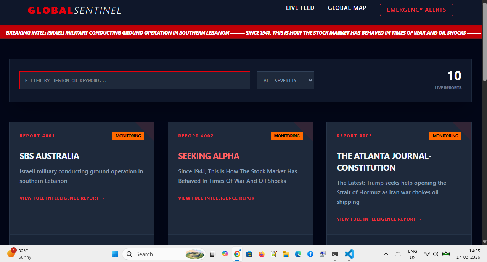

# 🛡️ Global Sentinel - Real-Time War Intelligence Dashboard

**Global Sentinel** is a professional-grade intelligence dashboard built to track global conflicts and military news in real-time. It leverages modern web technologies to provide a high-intensity command-center interface for monitoring global signals.

---

## 📸 Project Live Demo Preview

<div align="center">
  
  <p><em>Snapshot of the Live Dashboard featuring real-time intelligence feed and global mapping.</em></p>
</div>

---

## 🚀 Live Demo
Check out the live application: [**View Live Project on Vercel**](https://war-tracker-project-ia8m-git-main-anjaligupta3004s-projects.vercel.app/)

## ✨ Key Features
- **📡 Live Intelligence Feed:** Fetches real-time headlines using the GNews API with optimized asynchronous data handling.
- **🗺️ Global Visualization:** Integrated **Interactive World Map** using `react-simple-maps` to visualize active conflict zones with pulsing markers.
- **📊 Data Analytics:** Dynamic **Pie & Bar Charts** (via `Recharts`) providing a statistical breakdown of conflict severity.
- **🧠 Automated Severity Logic:** Custom algorithm scans headlines to categorize intel into *High Intensity*, *Monitoring*, or *Diplomatic* status.
- **📂 Secure Intelligence Vault:** Feature to "Save" critical reports into an encrypted-style `LocalStorage` vault for persistent tracking.
- **🎨 Cyber-Military Aesthetic:** Dark-mode HUD interface built with **Tailwind CSS**, featuring neon alerts and glassmorphism.
- **📱 Fully Responsive:** Optimized for consistent viewing on mobile command units and desktop stations.

## 🛠️ Tech Stack
- **Framework:** React 19 (Vite)
- **Visuals:** React-Simple-Maps & Recharts
- **Styling:** Tailwind CSS
- **State Management:** React Hooks & LocalStorage
- **Deployment:** Vercel

## ⚙️ Installation & Setup

1. **Clone the repository:**
   ```bash
   git clone [https://github.com/AnjaliGupta3004/war-tracker-project.git](https://github.com/AnjaliGupta3004/war-tracker-project.git)